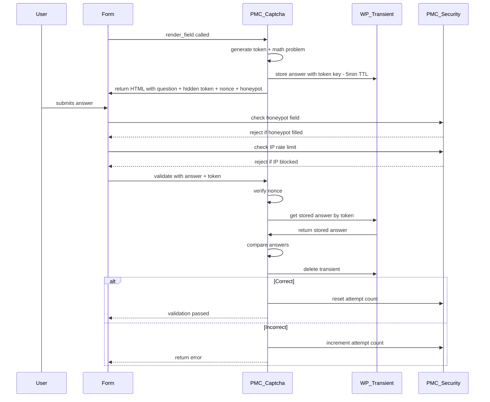

# Press Math Captcha — Architecture Plan

## Overview

A lightweight WordPress plugin that adds math-based CAPTCHA protection to WordPress login, Contact Form 7, and WooCommerce forms. No external services, GDPR-friendly, and WordPress.org compliant.

---

## File Structure

```
press-math-captcha/
├── press-math-captcha.php          # Main plugin bootstrap
├── uninstall.php                   # Clean uninstall handler
├── readme.txt                      # WordPress.org readme
├── includes/
│   ├── class-pmc-loader.php        # Hook/filter registration manager
│   ├── class-pmc-captcha.php       # Core captcha generator & validator
│   ├── class-pmc-admin.php         # Admin settings page
│   ├── class-pmc-login.php         # WP login form integration
│   ├── class-pmc-cf7.php           # Contact Form 7 integration
│   ├── class-pmc-woocommerce.php   # WooCommerce integration
│   └── class-pmc-security.php      # Rate limiting, IP block, honeypot
├── assets/
│   ├── css/
│   │   └── admin.css               # Admin page styles
│   └── js/
│       └── admin.js                # Admin page vanilla JS
└── languages/
    └── press-math-captcha.pot      # Translation template
```

---

## Architecture Diagram

```mermaid
graph TD
    A[press-math-captcha.php] --> B[PMC_Loader]
    B --> C[PMC_Captcha - Core Engine]
    B --> D[PMC_Admin - Settings Page]
    B --> E[PMC_Login - WP Login]
    B --> F[PMC_CF7 - Contact Form 7]
    B --> G[PMC_Woocommerce - WooCommerce]
    B --> H[PMC_Security - Rate Limit + Honeypot]

    C --> C1[Generate Math Problem]
    C --> C2[Store Answer via Transient]
    C --> C3[Validate User Answer]
    C --> C4[Render Captcha HTML]

    D --> D1[Settings API Registration]
    D --> D2[Options: enable/disable per form]
    D --> D3[Difficulty + Operation Config]
    D --> D4[Custom Error Message]

    E --> E1[Hook: login_form]
    E --> E2[Hook: authenticate]

    F --> F1[Register CF7 Tag: mathcaptcha]
    F --> F2[CF7 Validation Filter]

    G --> G1[Hook: woocommerce_login_form]
    G --> G2[Hook: woocommerce_register_form]
    G --> G3[Hook: woocommerce_process_login_errors]
    G --> G4[Hook: woocommerce_registration_errors]

    H --> H1[Track Failed Attempts via Transient]
    H --> H2[Temporary IP Block]
    H --> H3[Honeypot Hidden Field]
```



---

## Component Details

### 1. Main Plugin File — `press-math-captcha.php`

- Plugin header with all required fields
- `ABSPATH` check
- Define constants: `PMC_VERSION`, `PMC_PLUGIN_DIR`, `PMC_PLUGIN_URL`, `PMC_PLUGIN_BASENAME`
- Require all class files
- Instantiate `PMC_Loader` and call `pmc_run()`
- Register activation hook → set default options
- Register deactivation hook → cleanup if needed
- Load text domain via `plugins_loaded`

### 2. PMC_Loader — `class-pmc-loader.php`

- Stores arrays of actions and filters
- `add_action()` / `add_filter()` wrappers
- `run()` method registers all hooks with WordPress
- Conditionally loads integrations based on admin settings:
  - Login protection → `PMC_Login`
  - CF7 protection → `PMC_CF7` (only if CF7 is active)
  - WooCommerce protection → `PMC_Woocommerce` (only if WC is active)
- Always loads `PMC_Admin` and `PMC_Security`

### 3. PMC_Captcha — `class-pmc-captcha.php`

Core engine. All other integrations call this class.

**Methods:**

| Method | Purpose |
|--------|---------|
| `generate()` | Creates a math problem based on difficulty and operation settings |
| `render_field( $field_id )` | Returns HTML for the captcha field including nonce, hidden token, honeypot |
| `validate( $user_answer, $token )` | Validates the answer against stored transient |
| `get_difficulty_range()` | Returns min/max operand range based on difficulty |
| `get_operation()` | Returns the operation type or random pick |
| `store_answer( $token, $answer )` | Stores answer in a transient keyed by token |
| `get_stored_answer( $token )` | Retrieves and deletes the transient |

**Difficulty Ranges:**

| Level | Operand Range | Operations |
|-------|--------------|------------|
| Easy | 1–10 | Addition, Subtraction |
| Medium | 5–25 | Addition, Subtraction, Multiplication |
| Hard | 10–50 | All operations |

**Token System:**
- Generate a unique token per captcha render using `wp_generate_password( 32, false )`
- Store answer as transient: `pmc_captcha_{$token}` with 5-minute expiry
- Token is passed as a hidden field alongside the captcha input
- On validation, retrieve transient, compare, then delete

**Nonce:**
- Each captcha form includes `wp_nonce_field( 'pmc_captcha_nonce', 'pmc_nonce' )`
- Validated with `wp_verify_nonce()` before checking the answer

### 4. PMC_Admin — `class-pmc-admin.php`

**Menu Location:** Settings → Press Math Captcha

**Options (stored as single option `pmc_settings`):**

| Option Key | Type | Default | Description |
|------------|------|---------|-------------|
| `enable_login` | bool | true | Enable on WP login |
| `enable_cf7` | bool | true | Enable on CF7 forms |
| `enable_woocommerce` | bool | true | Enable on WooCommerce |
| `difficulty` | string | easy | easy / medium / hard |
| `operation` | string | random | addition / subtraction / multiplication / random |
| `hide_logged_in` | bool | true | Hide captcha for logged-in users |
| `error_message` | string | Incorrect answer... | Custom error message |
| `enable_rate_limit` | bool | true | Enable failed attempt tracking |
| `max_attempts` | int | 5 | Max failed attempts before block |
| `block_duration` | int | 15 | Block duration in minutes |

**Implementation:**
- Uses WordPress Settings API: `register_setting()`, `add_settings_section()`, `add_settings_field()`
- All outputs escaped with `esc_html()`, `esc_attr()`
- All inputs sanitized with `sanitize_text_field()`, `absint()`, `sanitize_callback`
- Capability check: `manage_options`

### 5. PMC_Login — `class-pmc-login.php`

**Hooks:**
- `login_form` → Render captcha field
- `authenticate` → Validate captcha before authentication

**Logic:**
- Check if login protection is enabled in settings
- Check `hide_logged_in` setting
- On `authenticate` filter, if captcha fails, return `WP_Error`
- Priority set to 30 on `authenticate` to run after default checks

### 6. PMC_CF7 — `class-pmc-cf7.php`

**Integration Points:**
- `wpcf7_init` → Register custom form tag `mathcaptcha` and `mathcaptcha*`
- `wpcf7_validate_mathcaptcha` / `wpcf7_validate_mathcaptcha*` → Validation filter
- Tag callback renders the captcha HTML
- Validation callback checks the answer and sets `$result->invalidate()` on failure

**Shortcode Usage:**
```
[mathcaptcha]        — optional
[mathcaptcha*]       — required
```

### 7. PMC_Woocommerce — `class-pmc-woocommerce.php`

**Hooks:**
- `woocommerce_login_form` → Render captcha on login
- `woocommerce_register_form` → Render captcha on registration
- `woocommerce_process_login_errors` → Validate login captcha
- `woocommerce_registration_errors` → Validate registration captcha

**Logic:**
- Check if WooCommerce protection is enabled
- Check `hide_logged_in` setting
- Return `WP_Error` on validation failure

### 8. PMC_Security — `class-pmc-security.php`

**Rate Limiting:**
- Track failed captcha attempts per IP using transients
- Key: `pmc_attempts_{$ip_hash}` (SHA-256 hashed IP for privacy)
- After `max_attempts` failures, block the IP for `block_duration` minutes
- Blocked IPs get a message instead of the form

**Honeypot:**
- Add a hidden field `pmc_website_url` styled with `display:none`
- If this field has any value, reject the submission silently
- Integrated into `PMC_Captcha::render_field()`

**IP Handling:**
- Use `$_SERVER['REMOTE_ADDR']` with fallback chain
- Hash IPs before storing (GDPR compliance)

### 9. Assets

**admin.css:**
- Styles for the settings page layout
- Form field styling
- Responsive design

**admin.js:**
- Vanilla JavaScript only (no jQuery)
- Toggle visibility of conditional settings
- Enqueued only on the plugin settings page via `admin_enqueue_scripts` with page hook check

### 10. Uninstall — `uninstall.php`

- Check `WP_UNINSTALL_PLUGIN` constant
- Delete option `pmc_settings`
- Clean up any transients with prefix `pmc_`

### 11. Translation — `languages/`

- All user-facing strings wrapped in `__()` or `esc_html__()`
- Text domain: `press-math-captcha`
- Domain path: `/languages`
- `.pot` file generated

---

## Security Checklist

- [x] `ABSPATH` check in every PHP file
- [x] Nonce verification on all form submissions
- [x] `current_user_can()` checks on admin pages
- [x] `sanitize_text_field()` on all inputs
- [x] `esc_html()` / `esc_attr()` on all outputs
- [x] No `eval()`, no `base64_decode()`, no obfuscated code
- [x] No external API calls or remote scripts
- [x] No tracking or analytics
- [x] Transient-based storage (no custom DB tables)
- [x] IP addresses hashed before storage
- [x] Honeypot field for bot detection
- [x] Rate limiting for brute force protection

---

## WordPress.org Compliance Checklist

- [x] Proper plugin headers
- [x] GPL2+ license
- [x] No premium upsells in free version
- [x] All strings internationalized
- [x] Proper escaping everywhere
- [x] No direct file access
- [x] Clean uninstall
- [x] No external dependencies loaded from CDN
- [x] readme.txt with proper format
- [x] Stable tag matches version
- [x] No use of `$_REQUEST` without sanitization

---

## Data Flow



---

## Default Option Values

```php
$defaults = array(
    'enable_login'      => 1,
    'enable_cf7'        => 1,
    'enable_woocommerce'=> 1,
    'difficulty'        => 'easy',
    'operation'         => 'random',
    'hide_logged_in'    => 1,
    'error_message'     => __( 'Incorrect captcha answer. Please try again.', 'press-math-captcha' ),
    'enable_rate_limit' => 1,
    'max_attempts'      => 5,
    'block_duration'    => 15,
);
```

---

## Implementation Order

1. Main plugin file with constants and bootstrap
2. Loader class for hook management
3. Core captcha engine (generate, store, validate, render)
4. Admin settings page
5. WordPress login integration
6. Contact Form 7 integration
7. WooCommerce integration
8. Security layer (rate limiting, honeypot)
9. CSS and JS assets
10. Translation template
11. readme.txt and uninstall.php
12. Final review and testing
